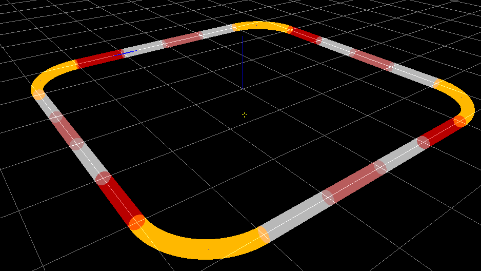

I'm an enthusiast of free and open source software. Here is a list of select side projects I've been working on. Check out my [GitHub repositories](https://github.com/jodersky?tab=repositories) for a more extensive list of open source contributions.

### Project Condor

*2014-2015*

\

Suite of projects related to engineering and navigating a quadrotor.

[project website](https://project-condor.github.io)

---

### akka-serial

*2013*

Library for serial communication from Scala, based on the actor model.

[project website](https://jodersky.github.io/akka-serial)

---

### k8055

*2012*

A linux compatible interface to the Velleman K8055 development board.

[project website](https://github.com/jodersky/k8055)

---

### Virtual Hadron Collider

*2011*

\

A particle simulator with 3D visualization, 1st year project in physics CS course.

[project website](https://github.com/jodersky/vhc)

---

### A Simple Mechanics Simulator (SiMS)

*2010*

\

A real-time mechanics simulator, my final year school project.

[project website](https://github.com/jodersky/sims)

---

## Signature
My public key's fingerprint is: `4E7D A7B5 A0F8 6992 D6EB  3F51 4601 8786 62E3 3372`

<i class="fa fa-hand-o-right"></i> Check identity on [keybase.io](https://keybase.io/jodersky)

